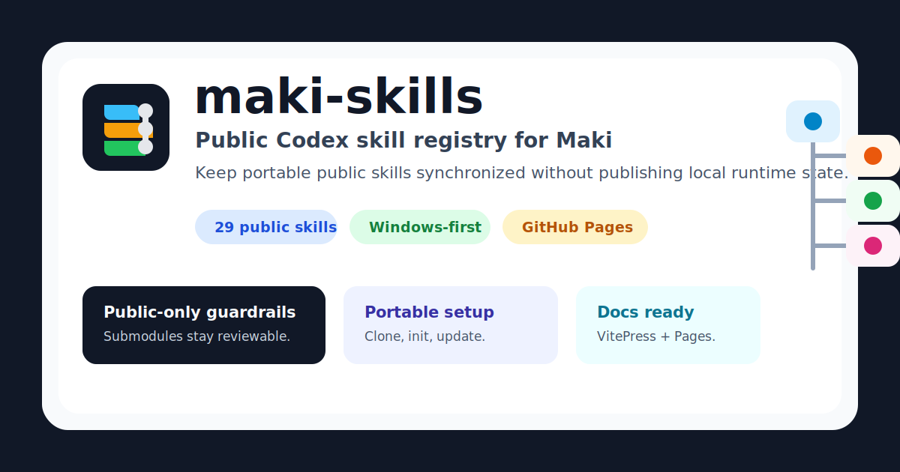

<div align="center">



# maki-skills

Maki 向けの公開 Codex skill submodule registry です。

<p>
  <a href="https://sunwood-ai-labs.github.io/maki-skills/"></a>
  <a href="LICENSE"></a>
  <a href=".gitmodules"></a>
</p>

<p>
  <a href="README.md">English</a> ·
  <a href="https://sunwood-ai-labs.github.io/maki-skills/">ドキュメント</a>
</p>

</div>

## ✨ このリポジトリが管理するもの

`maki-skills` は `%USERPROFILE%\.codex\skills` のうち、Git で公開管理できる部分だけを
切り出した registry です。現在は 29 個の公開 skill repository を submodule として tracking します。

bundled runtime、private/local skill、生成された dependency directory、公開 upstream を持たない
skill は意図的に tracking しません。

## 🚀 クイックスタート

Codex の skill directory に registry を clone し、公開 skill submodule を初期化します。

```powershell
git clone --recurse-submodules https://github.com/Sunwood-ai-labs/maki-skills.git "$env:USERPROFILE\.codex\skills"
git -C "$env:USERPROFILE\.codex\skills" submodule update --init --recursive
```

registry と submodule を更新します。

```powershell
git -C "$env:USERPROFILE\.codex\skills" pull --ff-only
git -C "$env:USERPROFILE\.codex\skills" submodule update --init --recursive
```

## 🧩 Skill カタログ

| Skill | 用途 |
| --- | --- |
| `android-termux-ssh-bootstrap` | Windows PC から Android 端末へ Termux over SSH を構築します。 |
| `cc-orchestrator-cli-skill` | PowerShell から Claude Code の agent-team workflow を扱います。 |
| `codex-spark-eclipse-legion` | 名前付き Codex Spark subagent と review lane を統括します。 |
| `comfyui-workflow-node-dev` | ComfyUI workflow と custom node を開発・修正・検証します。 |
| `draw-io` | draw.io diagram の作成、編集、export、layout lint を行います。 |
| `frontend-design` | production-grade frontend interface を設計・実装します。 |
| `gas-slack-bot` | Google Apps Script と Slack Events API bot を構築します。 |
| `gh-release-notes` | 実際の差分と tag から GitHub release notes を作成します。 |
| `git-flow-skill` | Git Flow branch 運用の計画、検証、復旧を支援します。 |
| `github-project` | GitHub CLI で GitHub Projects を作成・保守します。 |
| `gsap` | HyperFrames composition で GSAP animation pattern を使います。 |
| `hyperframes` | HTML video composition、caption、overlay、transition を作成します。 |
| `hyperframes-cli` | HyperFrames の init、lint、preview、render、TTS、diagnostics を実行します。 |
| `hyperframes-registry` | HyperFrames registry block と component を install/wire します。 |
| `jupytext-skill` | Jupyter notebook と Markdown text notebook を Jupytext で round-trip します。 |
| `logged-in-google-chrome` | Google にログイン済みの Chrome profile を再利用します。 |
| `m5stack-arduino-cli` | Windows で M5Stack Arduino project を setup・compile・flash します。 |
| `midnight-memory` | `midnight-memory` の subtitle section と Remotion output を管理します。 |
| `playwright-interactive` | `js_repl` で persistent browser/Electron debugging を行います。 |
| `remotion` | React-based video creation の Remotion best practice を適用します。 |
| `render-svg-layouts` | Node.js で deterministic な SVG-to-PNG visual asset を生成します。 |
| `repository-polish` | README、docs、metadata、QA、公開導線まで repository を整備します。 |
| `skill-setup` | 公開 git-backed skill 登録を PC 間で export/import します。 |
| `sourcesage-cli` | SourceSage で AI-friendly な repository summary を生成します。 |
| `svg-header-layout-checker` | SVG header artwork の markup/layout issue を確認します。 |
| `svg-header-layout-lint` | SVG header、hero、social-card artwork を lint/repair します。 |
| `timberborn-modding` | Timberborn の JSON mod や code mod を作成・debug します。 |
| `topview-skill` | Topview AI media generation workflow で image/video/avatar を作成します。 |
| `website-to-hyperframes` | website を capture して HyperFrames video に変換します。 |

## 🛠️ Registry の保守

skill を進める場合は、まず対象 skill repository 側を更新し、その後この repository で
submodule pointer だけを commit します。

```powershell
git -C "$env:USERPROFILE\.codex\skills\<skill-name>" pull --ff-only
git -C "$env:USERPROFILE\.codex\skills" status --short
git -C "$env:USERPROFILE\.codex\skills" add <skill-name>
git -C "$env:USERPROFILE\.codex\skills" commit -m "🔧 Update <skill-name> submodule"
```

commit 前には、`.gitignore` が local-only skill と runtime directory を守っていることを確認します。
親 repository で通常 commit するのは `.gitmodules`、README/docs、workflow、license metadata、
または意図した submodule pointer update です。

## 🩺 Troubleshooting

clone 後に skill directory が見えない場合は、submodule を再初期化します。

```powershell
git -C "$env:USERPROFILE\.codex\skills" submodule update --init --recursive
```

`git status --short` に `M <skill-name>` が出る場合、local submodule checkout が親 repository
に記録された pointer と違っています。その skill update が意図したものなら pointer を commit し、
無関係な registry commit には含めません。

`.gitmodules` には `main` 以外の branch を tracking する entry もあります。これは、その public skill
source が現在その branch にあるための registry metadata です。対応する skill update と一緒にだけ
変更します。

## 📚 Documentation

閲覧用 documentation は `docs/` にあり、VitePress で build します。

```powershell
Set-Location "$env:USERPROFILE\.codex\skills\docs"
npm install
npm run docs:build
```

`main` に反映された後、`.github/workflows/deploy-docs.yml` から GitHub Pages へ deploy します。

## 🧭 Repository 構成

```text
.
├─ .github/workflows/        # GitHub Pages deployment
├─ docs/                     # VitePress documentation
├─ <skill-name>/             # Public skill submodules
├─ .gitmodules               # Source repositories and tracked branches
├─ .gitignore                # Local runtime/private skill guardrails
├─ README.md                 # English overview
└─ README.ja.md              # Japanese overview
```

## 📄 License

この registry は [MIT License](LICENSE) で公開します。個々の skill submodule は、それぞれの
repository で宣言されている license に従います。
